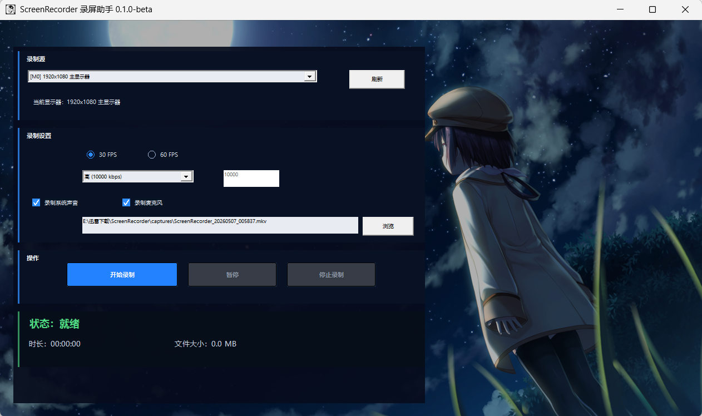

# ScreenRecorder 录屏助手

一款轻量级 Windows 桌面屏幕录制工具，支持显示器/窗口录制、系统声音、麦克风。



**当前版本：** 0.1.0-beta

---

## 技术栈

| 层级 | 技术 |
|------|------|
| 语言 | C++20 |
| 构建 | CMake 3.20+ / MSVC 2022 |
| 视频捕获 | Direct3D 11 + Desktop Duplication API (DXGI) |
| 视频编码 | FFmpeg libx264 → H.264 (YUV420P) |
| 音频捕获 | WASAPI 回环录制 + 麦克风采集 |
| 音频混音 | 自研双通道浮点混音器 |
| 音频编码 | FFmpeg AAC (FLTP) |
| 封装 | Matroska (MKV) |
| A/V 同步 | 固定帧率输出 + 音频 PTS 时钟限流 + Stop 尾部补齐 |
| UI 框架 | 原生 Win32 API + GDI+ 双缓冲绘制 |
| 安装包 | Inno Setup 6 |
| 图标 | Pillow 生成 PNG-compressed 多帧 ICO |

## 功能特性

- **显示器录制** — 选择任意显示器全屏录制，默认主屏幕
- **窗口录制** — 通过 DDA 区域裁剪录制指定窗口
- **系统声音** — WASAPI 回环捕获系统音频输出
- **麦克风** — WASAPI 捕获麦克风输入，自动混音
- **30 / 60 FPS** — 可选帧率，固定帧间隔输出
- **自定义码率** — 2500 / 5000 / 10000 kbps 或手动输入
- **MKV 输出** — `captures/ScreenRecorder_YYYYMMDD_HHMMSS.mkv`
- **热键控制** — Ctrl+Alt+R 开始/停止，Ctrl+Alt+P 暂停/继续
- **深色中文 UI** — 双缓冲无闪烁、响应式布局

## 快速开始

### 方式一：安装包

1. 下载 `ScreenRecorderSetup_0.1.0-beta.exe`
2. 双击运行，选择安装目录，完成安装
3. 从桌面快捷方式或开始菜单启动

### 方式二：便携版

1. 下载 `ScreenRecorder_0.1.0-beta.zip`
2. 解压到任意目录
3. 双击 `ScreenRecorder.exe`

### 使用方法

1. 启动后自动选择主屏幕作为录制源
2. 在"录制源"下拉框可切换显示器或窗口
3. 设置帧率（30 / 60 FPS）、码率、音频选项
4. 输出路径自动生成，也可点击"浏览"自定义
5. 点击 **开始录制** 或按 `Ctrl+Alt+R`
6. 录制中状态栏实时显示时长和文件大小
7. 点击 **停止录制** 或再次按 `Ctrl+Alt+R`
8. 录制完成后弹出提示，可打开文件所在目录

## 键盘快捷键

| 快捷键 | 功能 |
|--------|------|
| Ctrl+Alt+R | 开始 / 停止录制 |
| Ctrl+Alt+P | 暂停 / 继续录制 |

## 系统要求

- Windows 10 x64 或 Windows 11 x64
- 无需额外安装 FFmpeg（DLL 已内置）

## 项目结构

```
luping/
├── app/              # UI 层：主窗口、控件、热键
├── core/             # 核心调度：录制控制器、配置
├── capture/          # 视频捕获：DDA、显示器/窗口枚举
├── encoder/          # 视频编码：FFmpeg H.264 + MKV 封装
├── audio/            # 音频：WASAPI 捕获、混音、AAC 编码
├── platform/         # 平台层：D3D11 设备、日志
├── ui/               # UI 辅助：背景渲染
├── installer/        # Inno Setup 安装脚本
├── scripts/          # 构建/打包/图标生成脚本
├── resources/        # 图标资源
├── assets/           # UI 素材
└── dist/             # 发布产物
```

## 开发者构建

### 前置条件

- Visual Studio 2022（含 C++20 和 Windows SDK）
- CMake 3.20+
- FFmpeg SDK（开发库 + 头文件）

### 构建

```powershell
# 配置（需指定 FFmpeg 路径）
cmake -B build -G "Visual Studio 17 2022" -A x64 -DFFMPEG_ROOT=D:/ffmpeg

# 编译
cmake --build build --config Release
```

输出：`build/Release/ScreenRecorder.exe`

### 生成图标

```powershell
python scripts/generate_icons.py
```

### 打包发布

```powershell
# 创建 dist/ScreenRecorder/
powershell -ExecutionPolicy Bypass -File scripts/package_release.ps1 -FFmpegBin D:/ffmpeg/bin -Config Release

# 验证
powershell -ExecutionPolicy Bypass -File scripts/check_dist.ps1

# 构建安装包（需安装 Inno Setup 6）
powershell -ExecutionPolicy Bypass -File scripts/build_installer.ps1
```

## 核心实现细节

### 视频管线

```
DDA AcquireFrame → ID3D11Texture2D (BGRA)
  → CopySubresourceRegion → staging texture
  → Map → RGBA buffer
  → libswscale (BGRA→YUV420P) → AVFrame
  → libx264 → AVPacket
  → av_interleaved_write_frame → MKV
```

### 音频管线

```
WASAPI Capture (loopback + mic)
  → float sample buffers
  → AudioMixer (双通道浮点累加 + soft clip)
  → AAC encoder (FFmpeg, FLTP)
  → AVPacket
  → PTS rescale → av_interleaved_write_frame → MKV
```

### A/V 同步

- 录制线程以固定帧率运行（1000/fps ms 间隔）
- DDA 超时时自动重复上一帧保证帧率稳定
- 音频基于录制运行时钟限流，防止无限积压
- 停止时调用 `av_write_trailer` 前补齐尾部音频帧
- 最终 A/V delta < 0.5 秒

## 依赖

- **FFmpeg 7.x** (LGPL) — libavcodec / libavformat / libavutil / libswscale / libswresample
- **Windows SDK** — D3D11 / DXGI 1.2+ / WASAPI / Desktop Duplication API
- **Inno Setup 6** — 仅构建安装包时需要
- **Python 3 + Pillow** — 仅生成图标时需要

## 已知限制

详见 [docs/known-limitations.md](docs/known-limitations.md)。

- 窗口录制使用 DDA + 区域裁剪，非真正逐窗口捕获
- 窗口被遮挡时可能录到遮挡画面
- 独占全屏游戏可能导致 ACCESS_LOST
- 反作弊游戏很可能拒绝 DDA 捕获
- HDR 色彩未做转换处理
- **本工具不是 OBS 替代品**，覆盖常见桌面录制场景

## 测试反馈

参与外部测试请参阅 [docs/beta-test-guide.md](docs/beta-test-guide.md)，提交 Bug 请使用 [Bug 报告模板](docs/bug-report-template.md)。

日志文件：`logs/app.log`（exe 所在目录）。

## 免责声明

Beta 版本，不保证所有环境稳定。关键任务或生产环境使用请自行承担风险。游戏录制兼容性不做保证。
